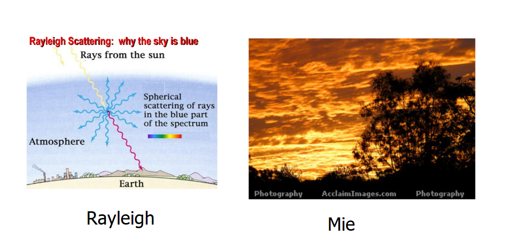

What is light? How does it behave?

These two questions need to be answered before we're able to set off on our journey toward simulated photorealism.

To get us started, I'll say that light is radiant electromagnetic energy, measured in <strong> Joules</strong>, traveling in localized particles -- or [wave packets](https://en.wikipedia.org/wiki/Wave_packet). Although light can be described in terms of both particles AND waves, Computer Graphics sticks to the particle model, focusing primarily on the simulation of light <strong>rays</strong>.

<strong>Rays</strong> are idealized models of light that are used to describe propagation through optical systems, typically defined using 2 3-dimensional vectors, one defining the source point of the ray, and another defining its direction.

<h3> How does light behave?</h3>
To (loosely) summarize the answer this question, I'll need to define the basic interactions a ray of light can have with the objects in our world.
  
With this list, I'll be able to develop a much better idea of what functionality my renderer needs to implement in order to produce a photorealistic image.

<ul style="list-style: none">
    <li>
        <h5>Reflection / Absorption</h5>
        The meat and taters of our raytracing. When light hits a surface, it'll bounce off of it. The main concepts to grasp here:
        <ul>
            <li>The angle of incidence = angle of reflectance.</li>
            <li>Whatever isn't reflected can be absorbed by the surface. </li>
        </ul>

</li>
<li>
<h5>Refraction</h5>
The bending of light as it moves through different media.
</li>

<li>
<h5>Scattering</h5>
Light is scattered by small particles in its path (smoke, clouds, etc.)
Atmospheric Scattering can be further broken down into two types:
<ul>
<li>
Rayleigh scattering - preferentially scatters light at the blue wavelength (this is what makes our sky blue).
</li>
<li>
Mie scattering - caused by water vapor, fumes, smoke, and dust (this gives sunsets that sexy red/orange look).

</li>
</ul>
</li>
<li>
<h5>Diffraction</h5>
The bending of light around objects, this contributes to soft shadows/color bleeding

</li>
<li>
<h5>Interferance</h5>
The superimposition of two waves. This can be constructive or destructive, depending on how the peaks and troughs of the waves line up  (peak / peak = constructive, peak / trough = destructive)

</li>

</ul>

Note: each of these interactions are dependent on the wavelength of the light, meaning the nitty gritties can change from color to color.

<h3>Next Time:</h3> 
Deciding on a programming language, and setting up a basic scene.

