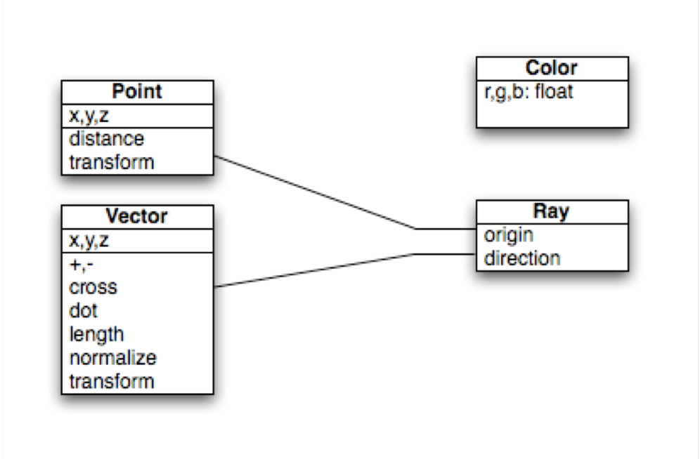
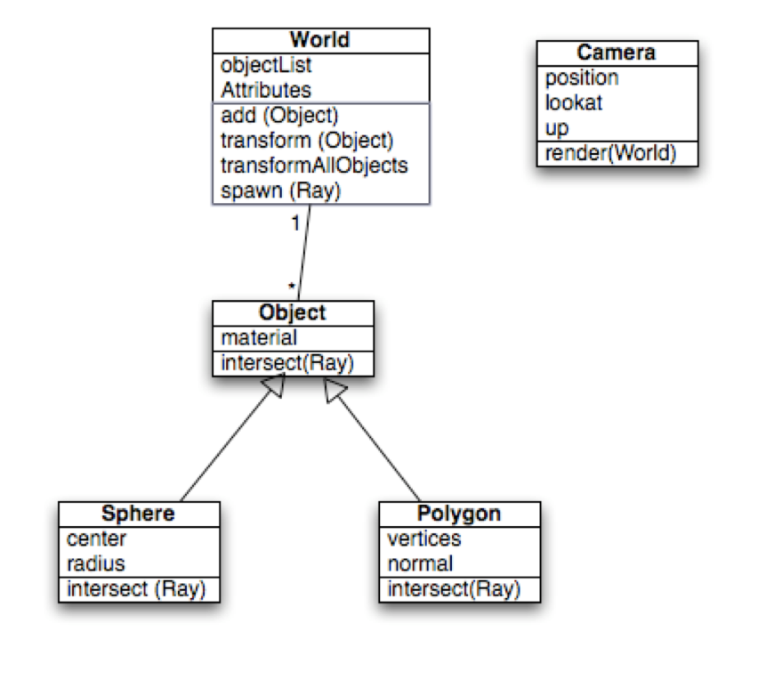
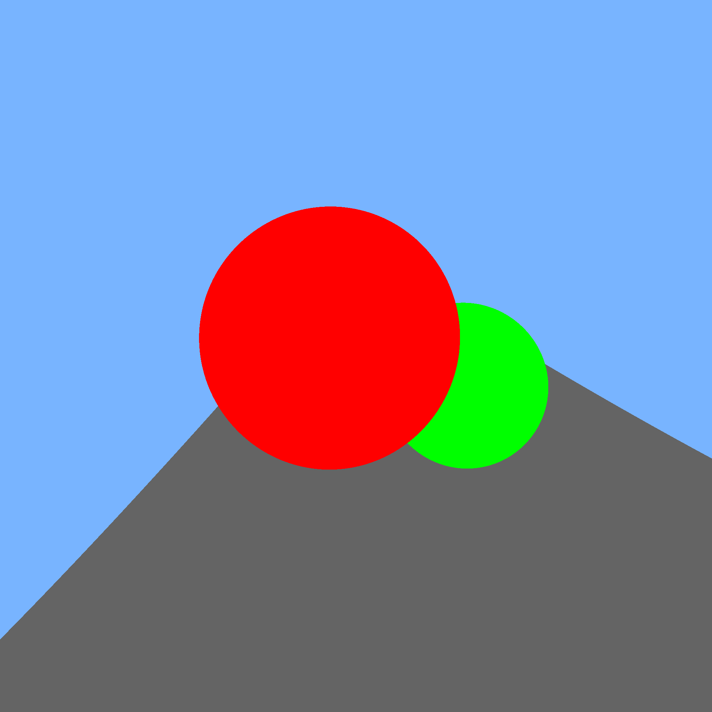

<h3>Shedding the Training Wheels</h3>

Oh boy, it's actually time to start coding now. 

Our goal for the next submission is recreating this image (with the freedom to choose our own colors) with our DIY rendering system. 

That means I need to do a couple of things:
<ul style="margin-left: 10%">
    <li>Pick a programming language.</li>
    <li>Logically organize my project in a way that makes future extensions easy.</li>
    <li>Start tracing some rays!</li>
</ul>

<h3>Choosing My Language</h3>

Generally, when writing graphics applications your programming language options are pretty limited. The default choice for a lot of people would be <strong>C/C++</strong> because both are compiled languages, meaning that the code you write is translated directly into the machine code instructions that the CPU executes.

On the other side of things, if speed is no issue, interpreted languages like <strong>Java</strong>, <strong>C#</strong>, or <strong>Python</strong> can be used. The advantages to be gained here can be pretty swell, as these languages are typically "easier" to use than their compiled counterparts. Plus, many of these languages have well supported tools/libraries for executing code on GPUs, which could come in very handy here. 

I have to note that in many cases, labeling a language as interpreted or compiled can be misleading. C# for example, is compiled into an "Intermediate Language" that is then compiled Just-In-Time (JIT) into platform-specific bytecode.

My choice is going to be C# (using the .NET Core framework). 
  Why? Because:

<ul style="margin-left: 10%">
    <li>C#/.NET is up-and-coming in terms of popularity and versitility.</li>
    <li><a href ="https://docs.microsoft.com/en-us/dotnet/core/">Microsoft's Documentation</a> is fantastic.</li>
    <li>I'm currently taking another class specifically about Design Patterns in C#/.NET Core</li>
</ul>

For now I'll need two external libraries, one for [vector/matrix math](https://www.nuget.org/packages/MathNet.Numerics/), and one for [image processing](https://www.nuget.org/packages/SixLabors.ImageSharp/) (colors, being able to create image files). 

<h3>Organizing</h3>
In this assignment's documentation, our professor gave us a few basic diagrams aimed at setting us on the right path toward a solid Object-Oriented approach. 
  

I've made a few changes to this schema:
<ol style="margin-left: 10%">
    <li>I got rid of the DIY color, Vector, and Point classes in favor of external implementations for each (thanks MathNET).</li>
    <li>I replaced the Polygon class with a Triangle class, because ray-triangle intersections are easier to code/compute than ray-polygon, and at the end of the day, <strong>every single complex object can be made out of triangles</strong>. </li>
    <li>Added a Plane class, which is actually just two triangles stuck together. </li>
    <li>Added a Material class, which (for now) just returns a basic color. </li>
    <li>Added a Raytracer class, which contains a world, a camera, and implements the main rendering/raytracing loop.</li>
</ol>

A further addition is a static MathExtensions class, which adds CrossProduct multiplication and Normalization to the MathNET Vector class, as well as a wrapper for MathNet's Quadratic equation solver. 

<h3>Tracing Rays</h3>

To remind you of the basic algorithm we're implmenting, I'll break it down into psuedo-code.

<ol style="margin-left: 10%">
    <li>Find the screen coordinate bounds that we'll shoot our rays through,</li>
    <li>Divide the screen coordinates into pixels.</li>
    <li>For each column of pixels:
        <ol type="A">
            <li>For each row of pixels:
            <ol type="a">
                <li>Cast a ray into the world, through the current screen coordinates.</li>
                <li>Set the current pixel color to the cast ray's returned color.</li>
            </ol>
            </li>
        </ol> 
    </li>
    <li>Save the generated image.</li> 
</ol>

The good news: it works! 

The bad news: I'm not really satisfied with the speed. Even without implementing any shading or reflections, rendering a 2000x2000 image like the one above takes 11-12 seconds on my laptop - a quad-core Surface Pro 6 that can simultaneously run 8 separate threads.

And it's a good thing I know how to use those threads! I rewrote the function in Parallel, using the Parallel.For() method provided in .NET Core in System.Threading.Tasks.

Using the multithreaded code, rendering the same 2000x2000 image on my laptop takes 5-6 seconds.