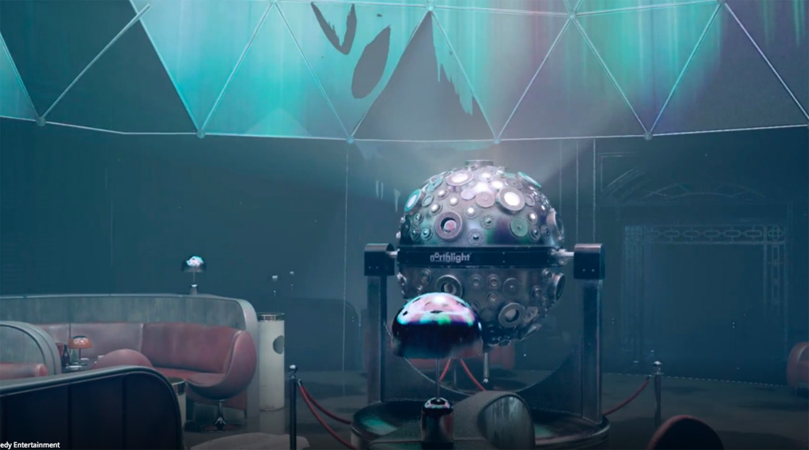
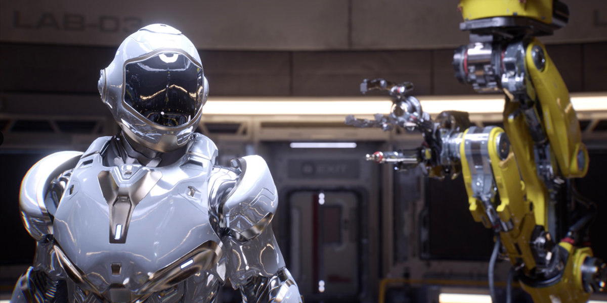

What is Physically Based Rendering?

To quote an excellent [resource on the subject:](http://www.pbr-book.org/)
>"Over the past decade, physically-based approaches to rendering have become widely used, where an accurate modeling of the physics of light scattering is at the heart of image synthesis. These approaches offer both visual realism and predictability."

Accurately modeling light is an incredible challenge, one that shows off the mind-bending recursive scale of the natural world. For instance: a single laser pulse of 0.338 J at 505 nm generates about 8.59 x 10^17 photons. That's <strong>one hundred quadrillion</strong> particles of light, all moving at the speed of - well - itself, reflecting off of surfaces,  colliding and interfering with each other, etc. 

The computational power that would be needed to model every photon in just that single laser pulse is well out of our reach (for now), let alone the power needed to simulate an entire scene full of lights. 

However, us humans, so good at cutting corners, have figured out a few decent shortcuts toward efficient, real-time raytracing.

<strong>TLDR:</strong> Physically Based Rendering (PBR) is a catch-all term for a few different methods for accurately simulating light in computer graphics.

