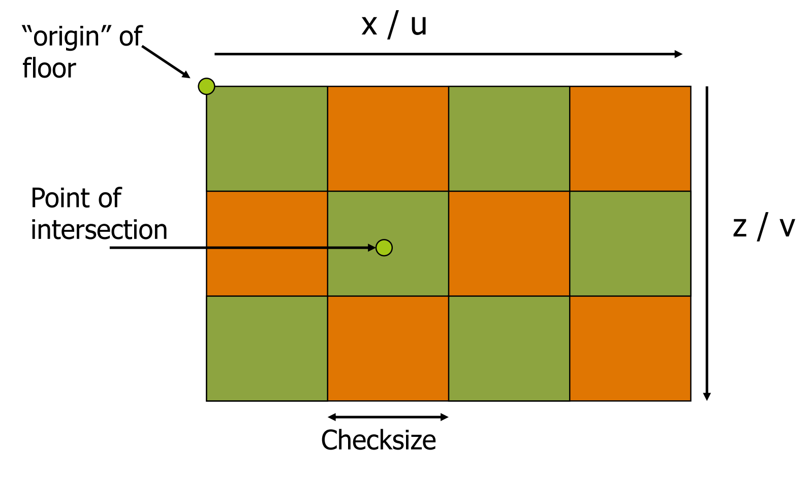
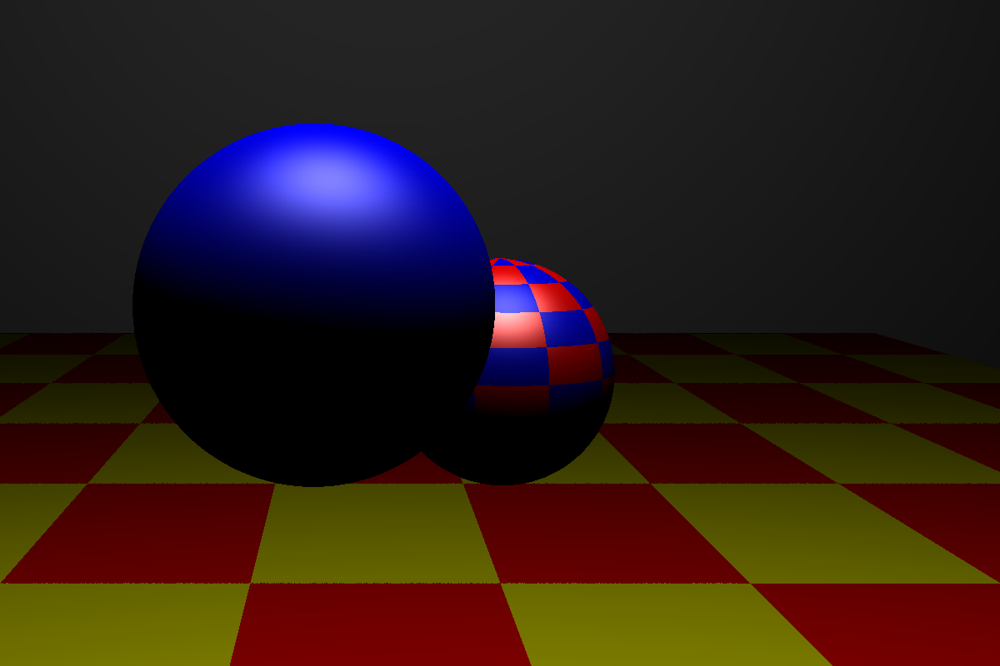
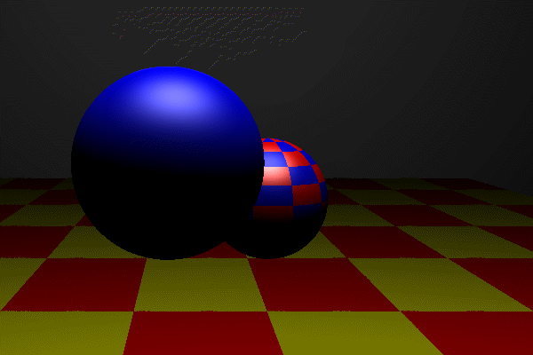

I've implemented a simple procedural texture!

My CheckerboxMaterial class stores two materials and a box size value.

When a ray intersects a 3D shape wearing the CheckerboxMaterial, the shape must provide the material with the corresponding 2D texture coordinates (u, v) normalized between -1 and 1. 

The coordinates are divided by the given box size to get a row / column of the texture map. Then, using a simple variable logical statement (in this case: checking whether the row and column are odd or even) we can decide which material the intersected point should have assigned.

(photo from Joe Geigel's CSCI-711 "Global Illumination" slides on texture mapping)

Here is a screen shot of my system's implementation:

And here is a neat little GIF of my system in motion:

