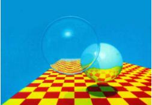
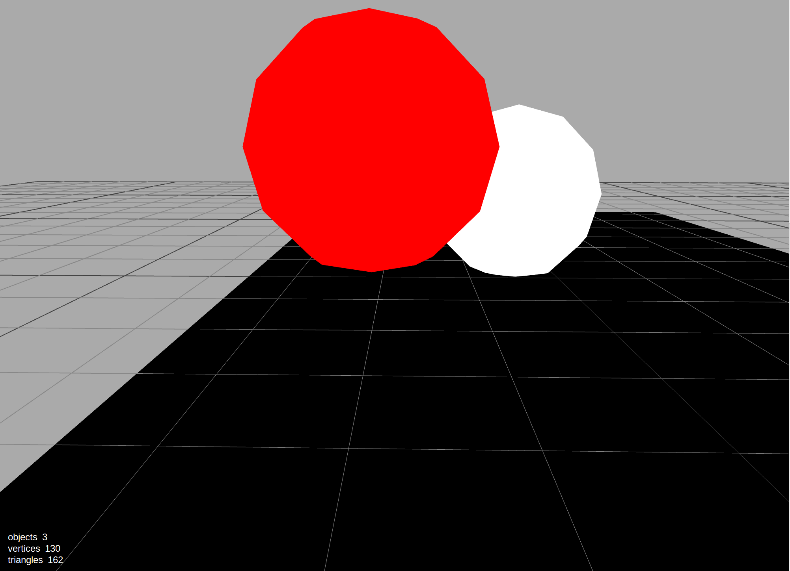
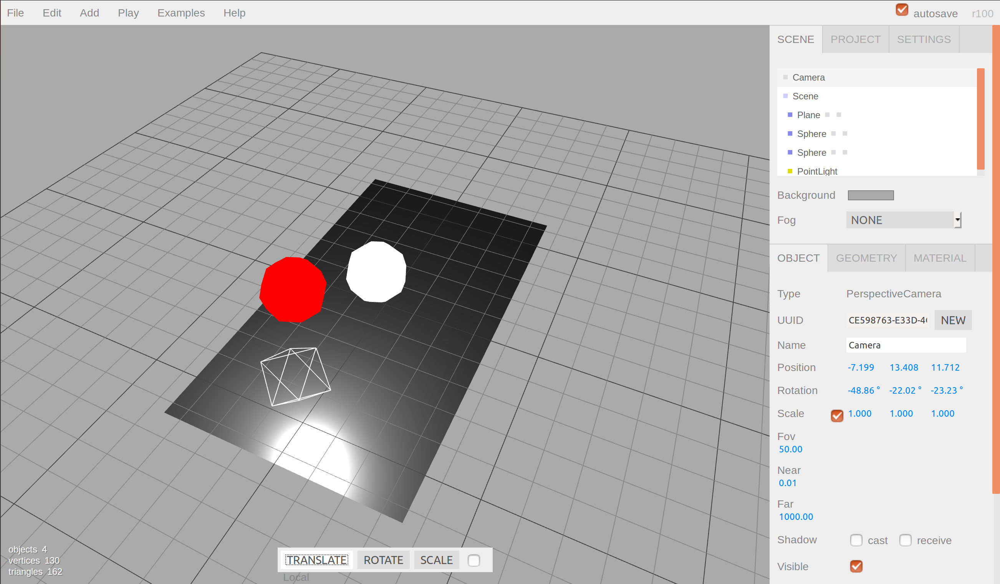

One of the first requirements of this project is submitting a screenshot recreating this image: 

We were allowed to use any rendering engine possible to do this, so I just googled "3D Javascript Editor"
and found [this website from three.js](https://threejs.org/editor/).

    
Camera: 
        Position: (-1.6, 1.579, 6.904)
        LookAt: (0, 0, 0)
    

    
Sphere (red): 
        Radius: 1
        Scale: (1, 1, 1)
        Position: (-2, 1.5, 2)
    

    
Sphere (white): 
        Radius: 1
        Scale: (1, 1, 1)
        Position: (-0.47, 0.926, -0.345)
    

    
Floor: 
        Scale: (7, 13, 7)
        Position: (0, 0, 0)
        Rotation: (-90deg, 0, 0)
    

    
Light: 
        Position: (0, 2, 5)
    

