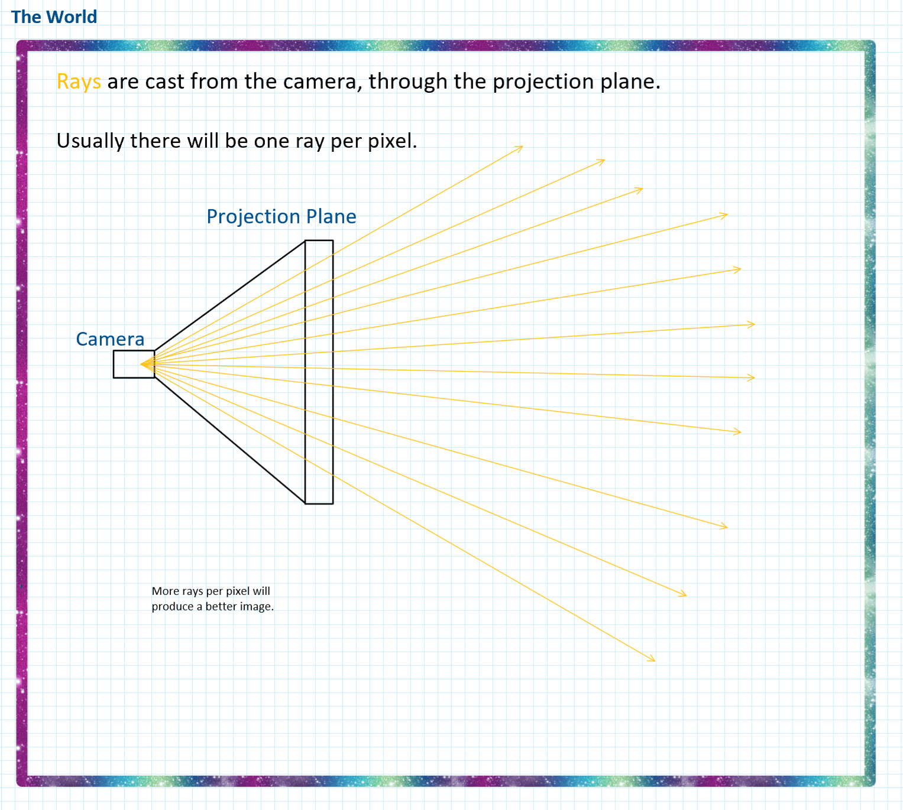
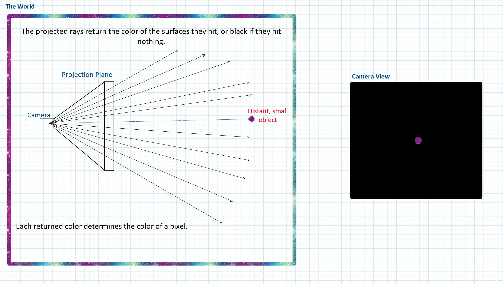
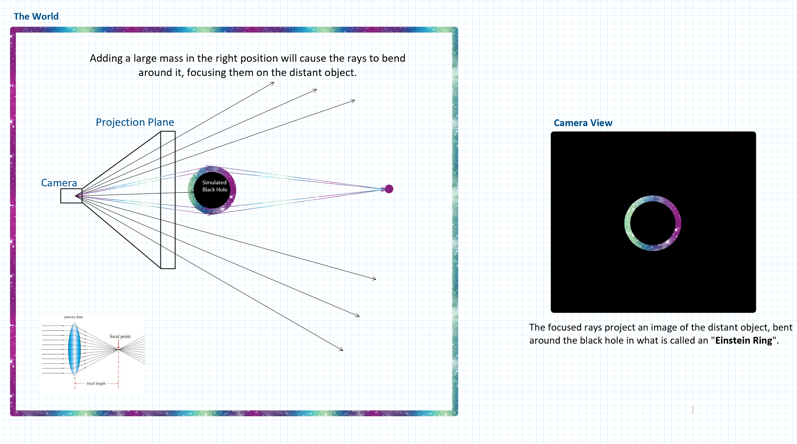
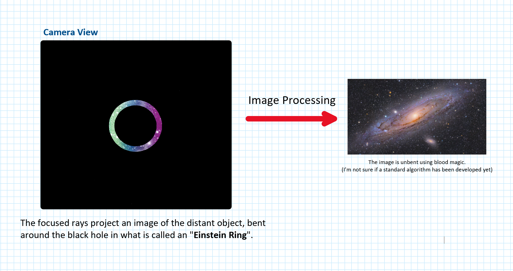

<meta charset='utf-8'>

<a href="https://docs.google.com/presentation/d/1fUvqI3LphGbBrgFzV5nnTQu2F_2tRae9h564b4szXx0/edit?usp=sharing">Link to Midterm Presentation</a>

Before I start talking about programming, I have one last thing to discuss. Apparently, developing a ray tracing renderer from scratch is NOT ENOUGH, and part of my grade is dependent on extending the renderer in a unique way.

<h3>🎶 Lets talk about gra-vi-ty 🎶</h3>

So, before I jump into my proposal, I'd like to give you a little background. I'm a big fan of the educational wing of youtube. To me, it has basically taken up the mantle left by the Science and Discovery channels since they shifted their business model to exclusively airing reality TV and Mythbusters re-runs.

One of my favorite channels is 
[PBS SpaceTime](https://www.youtube.com/channel/UC7_gcs09iThXybpVgjHZ_7g), their videos present current issues, theories, and experiments in astrophysics. A few years ago, they posted [this video](https://www.youtube.com/watch?v=Dgv2WWpm7_s&t=416s), introducing me to the concept of "Gravitational Lensing". 

To paraphrase [Wikipedia's definition](https://en.wikipedia.org/wiki/Gravitational_lens): "a gravitational lens is a large distribution of mass (galaxy clusters, black holes, stars, etc.), between a distant light source and an observer, that is capable of bending the light from the source as the light travels towards the observer."

Basically, light bends around massive objects, the same way it is bent by optical lenses. If that light is bent juuuuuust right, this can focus it on the sensors of our telescopes. Esentially allowing us to see into the universe much further, and with much greater clarity than previously possible. 

<h3>🎶 Let's talk about you-and-me 🎶 </h3>

So what does this have to do with physically-based rendering? 

Well, a lot. To explain, I've made some neat little diagrams.

This is a description of a basic ray tracer. A real camera works by catching all of the light rays in a scene that hit its sensor.

In rendering, we work backwards. A camera shoots rays out into a world, though a plane divided into pixels.

If we have a mostly empty world with one very small object in the distance, the camera will (naturally) return a small projection of the object. This is because most of the projected rays will completely miss it. 

Adding a large mass in the correct position will diffract a large number of the rays toward the small, distant object. This projects an image of the object on the outside of the mass, this is known as an [Einstein Ring](https://en.wikipedia.org/wiki/Einstein_ring)

From here, the circular image can be unbent using image processing techniques. From what I've found so far, this process is difficult, and only works in some cases. 

This idea may seem a little basic in terms of "extending" our simulation's capabilities, but I'd love to be able to experiment with this. I've also been doing research into getting real-time ray tracing to work, which would be very cool in combination with a lensing simulation.

I imagine a system where you could freely move an orbital camera around a mass, acting like a real-time telescope magnifying small, light emitting planes textured with images of galaxies that are littered around the world.

